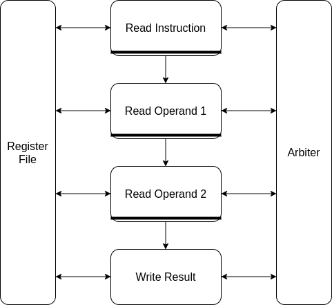

# Design of a new *pipelined* CPU

When designing a new pipelined version of the QNICE CPU, there is a elephant in
the room: An instruction such as `ADD @R0, @R1`, which itself is only a single
word in memory, will require four memory access: Reading the instruction,
reading from @R0, reading from @R1, and finally writing to @R1.  Since the
system bus in the QNICE only allows for a single memory access at a time, this
instruction must consume (at least) four clock cycles.

The design currently being worked on bases the pipelined approach on the above
observation: In each clock cycle the instruction proceeds from one stage to the next,
where each stage handles a single memory access. In other words, the first design
will have a four-stage pipeline:

* Stage 1: Read instruction
* Stage 2: Read operand 1
* Stage 3: Read operand 2
* Stage 4: Write result

Each of the above stages will have a memory interface (address and data)
feeding into a central arbiter. The purpose of the arbiter is to allow only a
single stage at a time access to the memory.

The four stages must be prioritized in some way. Presumably, priority should be
given to the highest numbered stage, so that the pipeline can be emptied as
quickly as possible. This priority scheme is still TBD.

The four stages also interact with the register file.

The current QNICE design allows combinatorial reads from both the register file
and from memory. Here memory read is synchronous to the falling clock edge, so
appears combinatorial from the CPU's perspective. We will probably later on
introduce flip-flops when reading from register file and/or memory, in order to
increase the clock frequency. However, in order to keep the design as simple as
possible, this is deferred to later.

So far, the design looks as follows:

The important design decisions are as follows:
* There are four stages.
* Each stage receives input in the same clock cycle as providing the output.

