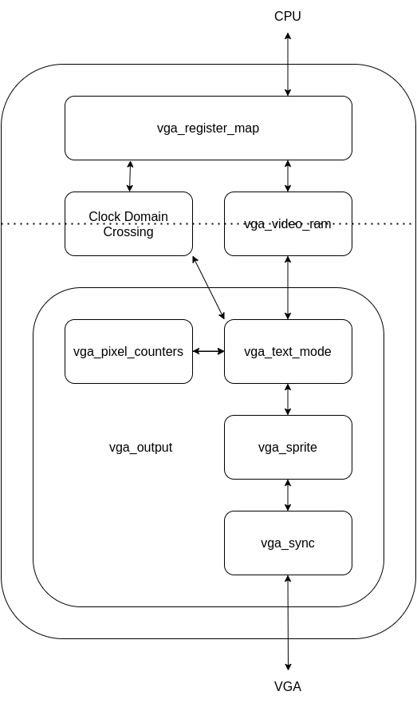

# VGA Multicolor Design

This file contains a brief description of the design of the VGA
module.

## Block Diagram

The VGA Multicolor block connects directly to the CPU and to the VGA output
port on the FPGA. The following is a block diagram:

Since the CPU runs at 50 MHz and the VGA output port runs at 25 MHz we have two
different clock domains. To avoid timing problems it is convenient to split the
VGA multicolor module into separate blocks each using only a single clock
signal. This separation between clock domains is marked in the diagram above by
the dotted line.

The file [vga_multicolor.vhd](vga_multicolor.vhd) therefore instantiates three
blocks:
* `vga_register_map`
* `vga_output`
* `vga_video_ram`

The first block (`vga_register_map`) connects to the CPU using only the CPU
clock domain (50 MHz), and the second block (`vga_output`) connects to the VGA
output port using only the VGA clock domain (25 MHz). Only the last block
(`vga_video_ram`) uses both clock domains. Furthermore, the block named "Clock
Domain Crossing" is responsible for copying the configuration and status
signals between the two clock domains.

Each of these blocks will be described below:

## `vga_register_map`
This entire block works solely in the CPU clock domain.

The core of this block is the signal `register_map` that contains the 24
registers (`0xFF30` - `0xFF47`) accessible by the CPU.

The output signals from this block are divided into two groups: One group
writes to and reads from the Video RAM and the other group provides
configuration signals directly to the `vga_output` block through the "Clock
Domain Crossing".

## `vga_output`
This block receives configuration signals from the `vga_register_map` block
(via "Clock Domain Crossing") as well as reads from the four parts of the Video
RAM (Display RAM, Font RAM, Palette RAM, and Sprite RAM). From these, this
block generates the VGA output signals.  This block consists of these three sub
blocks:
* `vga_pixel_counters`
* `vga_text_mode`
* `vga_sprite`
* `vga_sync`

These blocks will be described in the following:

### `vga_pixel_counters`
This small block generates the X and Y pixel coordinates in the intervals 0-799
and 0-524, as well as a frame counter in the interval 0-59. The counters wrap
around after exactly one second. The frame counter is used to control the
blinking cursor.

### `vga_text_mode`
This block receives the configuration signals from the `vga_register_map` and
the pixel counters from the block `vga_pixel_counters` and it reads data from
the Display RAM, the Font RAM, and the Palette RAM. It then generates an output
stream of pixel colors in RGB format.

The operation is divided into three steps:
1.  First it reads a single word from the Display RAM, where the address is
calculated from the current pixel coordinates.
2. Then it reads a single word from the Font RAM, where the address is calculated
from the value read from the Display RAM.
3. Finally it reads a single word from the Palette RAM, where the adress is
calculated from the values read from the Font RAM and the Display RAM.

### `vga_sprite`
This is the most complicated part of the design. The description of this block
is left to the end of this document.

### `vga_sync`
This small module generates the Horizontal and Vertical synchronization signals
needed for the VGA output. Furthermore, it blanks the screen (i.e. sets the
color output to black), when the current pixel is outside the screen area.

## `vga_video_ram`
This block makes use of True Dual Port (TDP) memory, which is a builtin part of
the FPGA. This is regular RAM with two completely independent ports, each with
their own address and data signals and even clock signals.

This block actually instantiates the block `true_dual_port_ram` six times,
one for each of:
* Display RAM  (64k words, corresponding to 20 screens of text)
* Font RAM     (8k words, corresponding to two sets of 8x12 font bitmaps)
* Palette RAM  (64 words, corresponding to two sets of 16-color palettes)
* Sprite Config RAM (4 words for each sprite)
* Sprite Palette RAM (16 words for each sprite)
* Sprite Bitmap RAM (32k words in total)

## `vga_sprite`
This block works by completely rendering an entire horizontal scanline, and
then storing it in memory.  This rendering takes place in the few pixel clock
cycles before the scanline is to be displayed, i.e. during the horizontal porch.

So this block actually consists of three parts:
* Renderer. This part is responsible for rendering and writing to the scanline memory.
* Scanline memory. This block stores the current scanline being rendered.
* Displayer. This part reads the pixels from the scanline memory.

### Renderer

### Scanline memory

### Displayer

